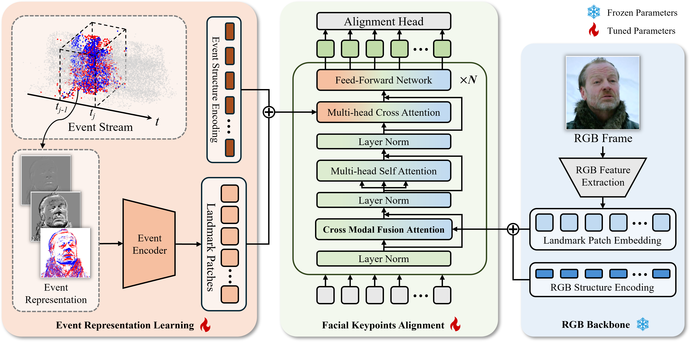

# Event-based Facial Keypoint Alignment via Cross-Modal Fusion Attention and Self-Supervised Multi-Event Representation Learning

## Overview

We propose a framework combining cross-modal fusion attention (CMFA) and self-supervised multi-event representation learning (SSMER) for facial keypoint alignment using event cameras. This approach integrates RGB data and learns from unlabeled event data to address spatial limitations.

## Run
- [CMFA](CMFA/README.md)
- [SSMER](SSMER/README.md)

